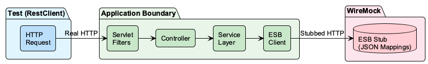
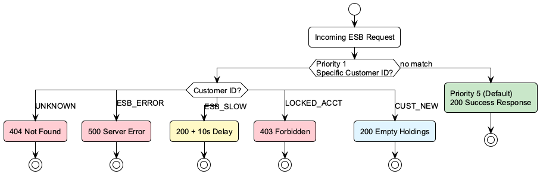
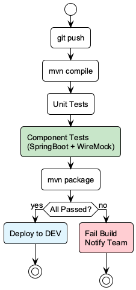
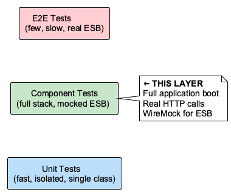
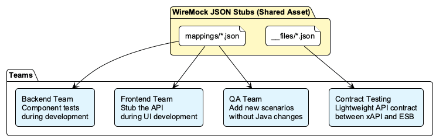

# Component Testing Strategy

## Overview

Component tests validate the full request lifecycle of the API — from HTTP request through to the external ESB boundary — with only the external dependencies mocked. Unlike unit tests that isolate a single class, component tests boot the entire Spring application and exercise the real wiring between layers.



## Test Architecture

### Technology Stack

| Component | Technology | Purpose |
|---|---|---|
| Test framework | JUnit 5 | Test execution and lifecycle |
| Application boot | `@SpringBootTest(RANDOM_PORT)` | Starts full embedded server |
| HTTP client (test) | Spring `RestClient` | Fluent, synchronous API calls |
| ESB mock server | WireMock Spring Boot 4.1.0 | Stubs external ESB HTTP responses |
| Assertions | AssertJ | Fluent, readable assertions |
| Test profile | `application-test.yml` | Overrides ESB base URL and timeouts |

### Maven Dependency

```xml
<dependency>
    <groupId>org.wiremock.integrations</groupId>
    <artifactId>wiremock-spring-boot</artifactId>
    <version>4.1.0</version>
    <scope>test</scope>
</dependency>
```

### Key Annotations (v4.x)

```java
@SpringBootTest(webEnvironment = SpringBootTest.WebEnvironment.RANDOM_PORT)
@EnableWireMock({
    @ConfigureWireMock(name = "esb-service", baseUrlProperties = "esb.base-url")
})
class InvestmentControllerComponentTest {

    @InjectWireMock("esb-service")
    private WireMockServer esbMock;
}
```

> **Note:** In WireMock Spring Boot v4.x, the `@ConfigureWireMock` annotation uses `baseUrlProperties` (not `property` from v3.x). Also, `urlPathAnyMatching()` was removed — use `anyUrl()` instead.

### What Gets Tested

| Layer | Tested | What It Validates |
|---|---|---|
| Servlet filters | Yes | Correlation ID injection, request/response logging |
| Request deserialization | Yes | JSON → DTO binding, content type negotiation |
| Bean validation (`@Valid`) | Yes | `@NotNull`, `@NotBlank`, custom validators |
| Controller logic | Yes | Request mapping, path variables, response codes |
| Service layer | Yes | Business logic, data transformation, orchestration |
| ESB client (RestClient/HttpClient) | Yes | HTTP call construction, headers, serialization |
| Response serialization | Yes | DTO → JSON, field naming, null handling |
| Error handling (`@ControllerAdvice`) | Yes | Exception → HTTP status mapping, error envelope |
| External ESB API | **Mocked** | WireMock provides deterministic responses |

## Project Structure

```
src/test/
├── java/com/westpac/xapi/investments/
│   └── controller/
│       └── InvestmentControllerComponentTest.java        ← Component test class
└── resources/
    ├── application-test.yml                    ← Test profile config
    └── wiremock/
        ├── mappings/                           ← Request matching rules
        │   ├── get-holdings-success.json
        │   ├── get-holdings-empty.json
        │   ├── get-holdings-not-found.json
        │   ├── post-switch-success.json
        │   ├── post-switch-duplicate.json
        │   ├── post-switch-forbidden.json
        │   ├── esb-server-error.json
        │   └── esb-timeout.json
        └── __files/                            ← Response body payloads
            ├── holdings/
            │   ├── success.json
            │   ├── empty.json
            │   ├── not-found.json
            │   └── esb-error.json
            └── switch/
                ├── accepted.json
                ├── duplicate.json
                └── forbidden.json
```

## Stub Approaches

### 1. JSON File-Based Stubs (Reusable)

WireMock auto-loads stubs from `src/test/resources/wiremock/`. These are best for common, reusable scenarios.

**Mapping file** (`mappings/get-holdings-success.json`):
```json
{
  "name": "Get Holdings - Success",
  "request": {
    "method": "GET",
    "urlPathPattern": "/esb/v1/accounts/[^/]+/holdings"
  },
  "response": {
    "status": 200,
    "bodyFileName": "holdings/success.json",
    "headers": {
      "Content-Type": "application/json"
    }
  }
}
```

**Response body** (`__files/holdings/success.json`):
```json
{
  "Data": {
    "holdings": [
      {
        "fundCode": "KS-GROWTH",
        "fundName": "KiwiSaver Growth Fund",
        "units": 1500.5432,
        "unitPrice": 2.3456,
        "marketValue": 3519.43
      }
    ]
  }
}
```

### 2. Programmatic Stubs (Test-Specific)

Defined inline in Java for scenarios that need per-test control. Programmatic stubs override file-based stubs.

```java
esbMock.stubFor(get(urlPathEqualTo("/esb/v1/accounts/CUST001/holdings"))
    .willReturn(serverError()
        .withHeader("Content-Type", "application/json")
        .withBody("""
            {"error": "Internal ESB error"}
            """)));
```

### Priority-Based Routing

WireMock matches stubs using priority (lower number = higher priority):

| Priority | Scope | Example |
|---|---|---|
| 1 | Customer-specific error scenarios | `UNKNOWN` → 404, `ESB_ERROR` → 500 |
| Default (5) | Generic happy-path catch-all | Any customer → 200 with holdings |

This means specific customer IDs trigger specific error responses, while all other IDs get the default success response.



## Scenario Coverage

### Holdings Endpoint (GET)

| Scenario | ESB Stub | Expected API Response |
|---|---|---|
| Valid customer with holdings | 200 + holdings JSON | 200 with transformed holdings |
| New customer, no holdings | 200 + empty array | 200 with empty holdings |
| Customer not found | 404 | 404 with error envelope |
| ESB internal error | 500 | 502 Bad Gateway |
| ESB timeout | 10s delay | 504 Gateway Timeout |
| ESB malformed response | Invalid JSON body | 502 Bad Gateway |

### Switch Endpoint (POST)

| Scenario | ESB Stub | Expected API Response |
|---|---|---|
| Valid switch request | 200 + accepted JSON | 200 with switch confirmation |
| Invalid request (validation) | N/A (never reaches ESB) | 400 Bad Request |
| Duplicate switch in progress | 409 | 409 Conflict |
| Account locked | 403 | 403 Forbidden |

### Cross-Cutting Concerns

| Scenario | What It Validates |
|---|---|
| Correlation ID propagation | ID from request header is forwarded to ESB |
| Correlation ID in response | ID is returned in the API response header |
| Standard error envelope | All errors follow the API envelope structure |

## Benefits for Automation

### CI/CD Pipeline Integration

Component tests run as part of the standard Maven build lifecycle with **zero external infrastructure** required:



```bash
mvn test                          # runs all tests including component tests
mvn verify                        # runs as part of integration test phase
mvn test -Dtest=InvestmentControllerComponentTest  # runs only component tests
```

No Docker containers, no external WireMock servers, no ESB connectivity — everything runs in-process.

### Shift-Left Testing

| Traditional Approach | Component Testing Approach |
|---|---|
| Deploy to DEV environment | Run locally during `mvn test` |
| Wait for ESB availability | WireMock stubs always available |
| Manual Postman testing | Automated, repeatable assertions |
| Bugs found in SIT/UAT | Bugs found at build time |
| Flaky tests from network issues | Deterministic, isolated tests |

### Regression Safety Net

Every code change automatically validates:
- API contracts have not broken (request/response structure)
- Error handling behaves correctly for all ESB failure modes
- Filters and interceptors are wired correctly
- Bean validation rules are enforced
- HTTP status codes map correctly from ESB responses

### Test Pyramid Alignment



Component tests sit in the middle of the test pyramid — they provide significantly more confidence than unit tests (by testing real wiring) while being faster and more reliable than end-to-end tests (by mocking external dependencies).

### Parallel Team Development



### Key Metrics Impacted

| Metric | Impact |
|---|---|
| Build feedback time | Tests complete in seconds, not minutes |
| Defect escape rate | Catches integration bugs before deployment |
| Environment dependency | Zero — no DEV/SIT environment needed to run |
| Test flakiness | Near zero — deterministic stubs, no network variability |
| Developer productivity | Instant feedback loop during local development |

## Adding New Test Scenarios

### Option 1: Add a JSON Mapping File

1. Create a new mapping in `src/test/resources/wiremock/mappings/`:
   ```json
   {
     "name": "Get Holdings - Rate Limited",
     "request": {
       "method": "GET",
       "urlPathPattern": "/esb/v1/accounts/RATE_LIMITED/holdings"
     },
     "response": {
       "status": 429,
       "bodyFileName": "holdings/rate-limited.json",
       "headers": {
         "Content-Type": "application/json",
         "Retry-After": "60"
       }
     },
     "priority": 1
   }
   ```

2. Add the response body in `src/test/resources/wiremock/__files/holdings/rate-limited.json`

3. Write the test assertion in `InvestmentControllerComponentTest.java`

### Option 2: Add a Programmatic Stub

Add a new `@Test` method with an inline stub:
```java
@Test
@DisplayName("should handle rate limiting from ESB")
void shouldHandleRateLimiting() {
    esbMock.stubFor(get(urlPathEqualTo("/esb/v1/accounts/CUST001/holdings"))
        .willReturn(aResponse()
            .withStatus(429)
            .withHeader("Retry-After", "60")));

    var response = restClient.get()
        .uri("/xapi/v1/investments/CUST001/holdings")
        .retrieve()
        .onStatus(status -> status.is4xxClientError(), (req, res) -> { })
        .toEntity(String.class);

    assertThat(response.getStatusCode().value()).isEqualTo(429);
}
```

## Running the Tests

```bash
# Run all tests
mvn test

# Run only component tests
mvn test -Dtest=InvestmentControllerComponentTest

# Run a specific test method
mvn test -Dtest="InvestmentControllerComponentTest#GetHoldings#shouldReturnHoldings"

# Run with verbose output
mvn test -Dtest=InvestmentControllerComponentTest -Dspring.test.verbose=true
```
