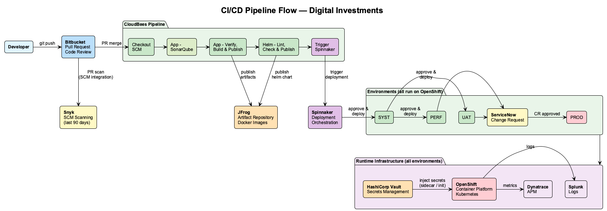
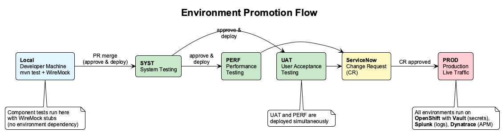

# Developer Onboarding Guide — Digital Investments Team

> **Last Updated:** February 2026
> **Audience:** New team members joining the xAPI / Digital Investments team
> **Purpose:** Get you from zero to productive as fast as possible — local setup, team workflows, tools, and access.

---

## Your First Week

Use this as your day-by-day guide. Don't try to do everything on Day 1 — focus on getting set up and understanding the codebase first.

### Day 1 — Access & Environment

- [ ] Raise ALL access requests (see [Access Request Checklist](#access-request-checklist)) — some take 2–3 days
- [ ] Clone the repository and set up your local environment (see [Local Development Setup](#local-development-setup))
- [ ] Meet your onboarding buddy
- [ ] Join team communication channels: _TODO: Add Teams/Slack channel names_

### Day 2 — Understand the System

- [ ] Clone the repository and follow the README (see [Local Development Setup](#local-development-setup))
- [ ] Explore the codebase — focus on the controller → service → ESB client flow
- [ ] Run the component tests and review how WireMock stubs work
- [ ] Read the existing API design documentation

### Day 3 — Team Workflow

- [ ] Understand the [Branching & PR Process](#branching--pr-process)
- [ ] Review the [CI/CD Pipeline](#pipeline-overview) and how deployments work
- [ ] Pair with a team member on a current story or bug fix
- [ ] Review 1–2 recent pull requests to understand code review standards

### Day 4–5 — First Contribution

- [ ] Pick up a small task (bug fix, test improvement, documentation)
- [ ] Create your first branch, make changes, raise a PR
- [ ] Get your first PR reviewed and merged
- [ ] Verify your change in the SYST environment (if access is ready)

> **Don't worry if access approvals delay some steps.** Focus on what you can do locally while waiting.

---

## Local Development Setup

Clone the repository and follow the **README.md** in the project root for architecture overview, prerequisites, build instructions, and IntelliJ setup.

```bash
git clone <bitbucket-repo-url>
cd xapi-wone-investments
```

> _TODO: Add Bitbucket repository URL_

---

## How We Work

### Branching & PR Process

```
main (or develop)
  └── feature/JIRA-123-add-kiwisaver-endpoint     ← your feature branch
  └── feature/JIRA-456-fix-validation-error        ← another developer's branch
  └── bugfix/JIRA-789-null-pointer-in-mapper       ← bug fix branch
```

| Step | Action |
|---|---|
| 1. Create branch | Branch off `develop` with `feature/JIRA-XXX-description` or `bugfix/JIRA-XXX-description` |
| 2. Develop | Make changes, write tests, run `./mvnw verify` locally |
| 3. Push & PR | Push branch to Bitbucket, create a Pull Request |
| 4. Code review | At least _TODO: Add number_ approvals required |
| 5. Merge | Squash merge into `develop` |
| 6. Deploy | CloudBees triggers Spinnaker — approve & deploy to SYST |

### PR Best Practices

- Keep PRs small and focused (one logical change per PR)
- Include a clear description of what and why
- Add test coverage for new code
- Respond to review comments within 24 hours
- Run `./mvnw verify` before pushing — don't break the build

### Team Ceremonies

| Ceremony | Frequency | Purpose |
|---|---|---|
| Stand-up | Daily | Quick sync — blockers, progress, plans |
| Sprint Planning | _TODO: Add frequency_ | Plan upcoming sprint work |
| Retro | _TODO: Add frequency_ | Reflect and improve |
| Refinement | _TODO: Add frequency_ | Clarify upcoming stories |
| Tech Huddle | _TODO: Add frequency_ | Discuss architecture, tech debt, patterns |

---

## Pipeline Overview



| Tool | Purpose | Stage |
|------|---------|-------|
| Bitbucket | Source code management & pull requests | Code |
| Snyk | SCM scanning — security & vulnerability checks on PRs | Code (PR) |
| CloudBees | CI/CD pipeline — orchestrates the entire build-to-deploy flow | Build |
| ↳ SonarQube | Code quality analysis & quality gate (CloudBees stage) | Build |
| ↳ JFrog Artifactory | Artifact & Helm chart repository (CloudBees publishes here) | Build |
| ↳ Helm | Chart linting, deprecation check & publish (CloudBees stages) | Build |
| ↳ Spinnaker | Deployment orchestration (triggered by CloudBees) | Deploy |
| OpenShift | Container platform (runtime) | Run |
| HashiCorp Vault | Secrets management (API keys, credentials, certificates) | Run |
| Splunk | Log aggregation & search | Monitor |
| Dynatrace | APM & performance monitoring | Monitor |

### Environment Promotion



| Environment | Purpose | Deploy Method | Who Can Access |
|---|---|---|---|
| **Local** | Developer testing (WireMock stubs) | `./mvnw spring-boot:run` | You |
| **SYST** | System testing | Approve & deploy in Spinnaker | Dev team |
| **UAT** | User acceptance testing | Approve & deploy in Spinnaker (simultaneous with PERF) | Dev + QA |
| **PERF** | Performance testing | Approve & deploy in Spinnaker (simultaneous with UAT) | Dev + QA + Perf |
| **PROD** | Live customer traffic | Change Request (CR) approved in ServiceNow | Ops + on-call |

---

## Access Request Checklist

Raise all requests via **MyAccess / ServiceNow** on your **first day**. Some approvals take 2–3 business days.

| # | Tool | Access Request | Approver | Status |
|---|------|---------------|----------|--------|
| 1 | Bitbucket | _TODO: Add entitlement name_ | Manager | ☐ |
| 2 | CloudBees | _TODO: Add entitlement name_ | Manager | ☐ |
| 3 | SonarQube | _TODO: Add entitlement name_ | Manager | ☐ |
| 4 | JFrog Artifactory | _TODO: Add entitlement name_ | Manager | ☐ |
| 5 | Snyk | _TODO: Add entitlement name_ | Manager | ☐ |
| 6 | Spinnaker | _TODO: Add entitlement name_ | Manager | ☐ |
| 7 | OpenShift | _TODO: Add entitlement name_ | Manager | ☐ |
| 8 | HashiCorp Vault | _TODO: Add entitlement name_ | Manager | ☐ |
| 9 | ServiceNow | _TODO: Add entitlement name_ | Manager | ☐ |
| 10 | Splunk | _TODO: Add entitlement name_ | Manager | ☐ |
| 11 | Dynatrace | _TODO: Add entitlement name_ | Manager | ☐ |

---

## Tool Details

### 1. Bitbucket

**What is it?**
Bitbucket is our source code management platform. All team repositories are hosted here. We use it for version control, pull requests, code reviews, and branch management.

**URL:**
_TODO: Add Bitbucket instance URL_

**How to Get Access:**
1. Go to MyAccess / ServiceNow
2. Search for: _TODO: Add entitlement name (e.g., "Bitbucket Developer")_
3. Submit the request — requires manager approval
4. Once approved, request access to the team project/repository from the tech lead

**Key Things to Know:**
- **Team Project:** _TODO: Add project name_
- **Main Repository:** _TODO: Add repo name (e.g., xapi-wone-investments)_
- **Branching Strategy:** _TODO: Add branch strategy (e.g., feature branches off develop, PRs to develop, release branches for deployments)_
- All PRs require at least _TODO: Add number_ approvals before merging
- Ensure your commits follow the team's commit message conventions

**Useful Links:**
- _TODO: Add links to internal Bitbucket guides or team wiki pages_

---

### 2. CloudBees

**What is it?**
CloudBees is our CI/CD platform built on Jenkins. It orchestrates the **entire build-to-deploy flow** — from code checkout through to triggering Spinnaker deployment.

**URL:**
_TODO: Add CloudBees instance URL_

**How to Get Access:**
1. Go to MyAccess / ServiceNow
2. Search for: _TODO: Add entitlement name (e.g., "CloudBees User")_
3. Submit the request — requires manager approval

**Pipeline Stages:**

The CloudBees pipeline runs the following stages in order on PR merge:

| # | Stage | What It Does | Typical Duration |
|---|-------|-------------|-----------------|
| 1 | **Checkout SCM** | Clones the repository from Bitbucket | ~1s |
| 2 | **App - SonarQube** | Static code analysis and quality gate check | ~1–2 min |
| 3 | **App - Verify, Build & Publish** | Runs tests (`mvn verify`), builds the artifact, publishes to JFrog | ~1–2 min |
| 4 | **Helm - Lint** | Validates Helm chart syntax | ~18s |
| 5 | **Helm - Deprecation Check** | Checks for deprecated Helm APIs | ~1s |
| 6 | **Helm - Publish** | Publishes Helm chart to JFrog | ~2s |
| 7 | **Spinnaker** | Triggers the Spinnaker deployment pipeline | ~10s |
| 8 | **archiveArtifacts** | Archives build artifacts for reference | <1s |
| 9 | **Workspace Cleanup** | Cleans up the build workspace | ~1s |

**Key Things to Know:**
- **Team Folder / Pipeline Location:** _TODO: Add folder path (e.g., /Teams/DigitalInvestments/xapi-wone-investments)_
- **Pipeline Triggers:** _TODO: Describe when pipelines run (e.g., on every PR, on merge to master)_
- **Build Notifications:** _TODO: Add where build notifications go (e.g., Teams channel, email)_
- If a stage fails, the pipeline stops — check the **console output** in CloudBees for error details before reaching out
- The **Spinnaker stage** means deployment is triggered automatically by CloudBees — you don't need to manually trigger Spinnaker

**Useful Links:**
- _TODO: Add links to Jenkinsfile location, pipeline documentation_

---

### 3. SonarQube

**What is it?**
SonarQube is our code quality analysis platform. It performs static analysis during the CloudBees build phase, checking for code smells, bugs, vulnerabilities, code duplication, and test coverage. A **quality gate** must pass before the pipeline proceeds — if it fails, the build is blocked.

**URL:**
_TODO: Add SonarQube instance URL_

**How to Get Access:**
1. Go to MyAccess / ServiceNow
2. Search for: _TODO: Add entitlement name (e.g., "SonarQube Developer")_
3. Submit the request — requires manager approval

**Key Things to Know:**
- **Team Project Key:** _TODO: Add project key in SonarQube_
- **Quality Gate:** The default gate checks:
    - No new **critical** or **blocker** issues
    - Code coverage on new code ≥ _TODO: Add threshold (e.g., 80%)_
    - Duplication on new code ≤ _TODO: Add threshold (e.g., 3%)_
- **When the quality gate fails:** Check the SonarQube dashboard for the failing condition, fix the issue locally, and re-push
- Run SonarQube analysis locally before pushing to catch issues early:
    ```bash
    ./mvnw verify sonar:sonar -Dsonar.host.url=<sonar-url> -Dsonar.token=<your-token>
    ```
- **Common Issues Flagged:**
    - Unused variables and imports
    - Unclosed resources (streams, connections)
    - Empty catch blocks
    - Cognitive complexity too high
    - Insufficient test coverage on new code

**Useful Links:**
- _TODO: Add links to SonarQube quality profiles, team rules configuration_

---

### 4. JFrog Artifactory

**What is it?**
JFrog Artifactory is our artifact repository. Build artifacts (JARs, Docker images) are published here and consumed during deployments. It also acts as a proxy for external Maven/Gradle dependencies.

**URL:**
_TODO: Add JFrog instance URL_

**How to Get Access:**
1. Go to MyAccess / ServiceNow
2. Search for: _TODO: Add entitlement name_
3. Submit the request — requires manager approval

**Key Things to Know:**
- **Team Repository:** _TODO: Add repository name_
- Artifacts are automatically published by CloudBees pipelines on successful builds
- Use the team's repository for resolving dependencies in your local `settings.xml` or `build.gradle`

**Useful Links:**
- _TODO: Add links to artifact repository configuration guides_

---

### 5. Snyk

**What is it?**
Snyk provides **SCM scanning** integrated directly with Bitbucket. It scans your code and dependencies for known vulnerabilities, licence issues, and security risks at the **pull request level** — not as part of the CloudBees build pipeline.

**How it works:**
- Snyk SCM scanning is enabled for all commits from the last 90 days in Bitbucket
- When you create or update a PR, Snyk automatically scans the changes
- Scan results appear as a **build status check** on your PR — you'll see "Snyk scan passed" or "Snyk scan failed"
- If the scan fails, you must fix the vulnerability before merging

**URL:**
_TODO: Add Snyk website/dashboard URL_

**How to Get Access:**
1. Go to MyAccess / ServiceNow
2. Search for: _TODO: Add entitlement name_
3. Submit the request — requires manager approval

**Key Things to Know:**
- **Dashboard Organisation:** _TODO: Add org/project name in Snyk_
- Scans cover: dependency vulnerabilities, licence compliance, and code security issues
- Critical and high vulnerabilities must be addressed before merging
- Check the Snyk dashboard regularly for new vulnerabilities in existing dependencies — even merged code can become vulnerable when new CVEs are published

**Useful Links:**
- _TODO: Add links to Snyk policies, vulnerability triage process_

---

### 6. Spinnaker

**What is it?**
Spinnaker is our deployment orchestration tool. It manages deployments across environments (SYST, UAT, PERF, PROD) with approval gates and rollback capabilities. Spinnaker is **triggered automatically by CloudBees** as the final pipeline stage — you do not need to trigger it manually.

**URL:**
_TODO: Add Spinnaker instance URL_

**How to Get Access:**
1. Go to MyAccess / ServiceNow
2. Search for: _TODO: Add entitlement name_
3. Submit the request — requires manager approval

**Key Things to Know:**
- **Team Application:** _TODO: Add application name in Spinnaker_
- **Environments:** SYST → UAT + PERF (simultaneous) → CR in ServiceNow → PROD
- **How it's triggered:** CloudBees pipeline triggers Spinnaker after successful build, test, and Helm chart publish
- **Deployment Flow:** SYST (approve & deploy) → UAT + PERF (approve & deploy, simultaneous) → PROD (requires approved CR in ServiceNow)
- Production deployments require an approved **Change Request (CR)** in ServiceNow before Spinnaker will proceed
- Familiarise yourself with the rollback process before deploying

**Useful Links:**
- _TODO: Add links to deployment runbooks, release process documentation_

---

### 7. OpenShift

**What is it?**
OpenShift is our container platform (Kubernetes-based) where our applications run. It manages pods, services, routes, config maps, and secrets for our microservices.

**URL:**
_TODO: Add OpenShift console URL_

**How to Get Access:**
1. Go to MyAccess / ServiceNow
2. Search for: _TODO: Add entitlement name_
3. Submit the request — requires manager approval
4. You may also need namespace-level access — request this from the tech lead

**Key Things to Know:**
- **Team Namespace(s):** _TODO: Add namespace names per environment (e.g., digital-investments-sit, digital-investments-uat)_
- Use `oc` CLI to interact with OpenShift from your terminal
- **Key Commands:**
    - `oc login <cluster-url>` — Log in to the cluster
    - `oc project <namespace>` — Switch to the team namespace
    - `oc get pods` — List running pods
    - `oc logs <pod-name>` — View pod logs
    - `oc describe pod <pod-name>` — Check pod events and status
    - `oc rsh <pod-name>` — Remote shell into a pod (use sparingly)
- Check pod health and resource usage via the OpenShift web console

**Useful Links:**
- _TODO: Add links to OpenShift guides, namespace configuration docs_

---

### 8. HashiCorp Vault

**What is it?**
HashiCorp Vault is our secrets management platform. It securely stores and controls access to sensitive data such as API keys, database credentials, ESB passwords, certificates, and encryption keys. Our applications in OpenShift retrieve secrets from Vault at startup rather than storing them in config files or environment variables.

**URL:**
_TODO: Add Vault UI URL_

**How to Get Access:**
1. Go to MyAccess / ServiceNow
2. Search for: _TODO: Add entitlement name (e.g., "Vault Reader")_
3. Submit the request — requires manager approval
4. Request access to the team's secret path from the tech lead

**Key Things to Know:**
- **Team Secret Path:** _TODO: Add path (e.g., `secret/digital-investments/xapi-wone-investments/`)_
- **How Secrets Reach the App:**
    - Vault Agent runs as an **init container or sidecar** in OpenShift pods
    - At pod startup, Vault Agent authenticates using the pod's service account (Kubernetes auth method)
    - Secrets are injected as files or environment variables before the Spring Boot app starts
    - The app reads secrets via Spring properties — e.g., `${esb.api-key}` resolves from Vault-injected values
- **Secret Types We Store:**
    - ESB API keys and credentials
    - Database connection strings and passwords
    - TLS/SSL certificates
    - Third-party service tokens
    - Encryption keys
- **Environment Separation:** Each environment (SYST, UAT, PERF, PROD) has its own secret path — secrets are **never** shared across environments
- **Secret Rotation:** Secrets can be rotated in Vault without redeploying the app — pods pick up new values on next restart
- **Local Development:** Secrets are **not** needed locally — WireMock stubs replace real ESB calls. For `application-local.yml`, use dummy placeholder values
- **Never** commit secrets to source code, config files, or environment variable definitions in deployment manifests

**Common Vault CLI Commands:**
```bash
# Log in to Vault
vault login -method=ldap username=<your-username>

# List secrets at a path
vault kv list secret/digital-investments/xapi-wone-investments/

# Read a specific secret
vault kv get secret/digital-investments/xapi-wone-investments/esb-credentials

# Check secret metadata (version history, last updated)
vault kv metadata get secret/digital-investments/xapi-wone-investments/esb-credentials
```

**Useful Links:**
- _TODO: Add links to Vault policies, secret request process, rotation runbooks_

---

### 9. ServiceNow

**What is it?**
ServiceNow is our IT service management (ITSM) platform. We use it primarily for raising **Change Requests (CRs)** before deploying to production. No code goes to PROD without an approved CR. You'll also use ServiceNow for incident management, access requests, and general IT support.

**URL:**
_TODO: Add ServiceNow instance URL_

**How to Get Access:**
1. Go to MyAccess / ServiceNow
2. Search for: _TODO: Add entitlement name (e.g., "ServiceNow ITIL User")_
3. Submit the request — requires manager approval

**Key Things to Know:**
- **Change Requests (CRs):**
    - A CR must be raised and approved **before** any PROD deployment
    - CRs are raised after successful UAT and PERF testing
    - Include: what is changing, rollback plan, testing evidence, deployment window
    - CR types: **Standard** (pre-approved, low risk) vs **Normal** (requires approval board review)
    - _TODO: Add typical CR approval turnaround time_
- **CR Workflow:**
    1. Developer raises a CR in ServiceNow with deployment details
    2. Attach testing evidence (UAT sign-off, PERF test results)
    3. CR is reviewed and approved by _TODO: Add approver (e.g., Change Manager, CAB)_
    4. Once approved, Spinnaker deployment to PROD is unblocked
    5. After deployment, close the CR with the outcome
- **Incidents:**
    - Production issues are tracked as Incidents in ServiceNow
    - _TODO: Add team's assignment group name_
    - Familiarise yourself with incident severity levels (P1–P4)
- **Other Uses:**
    - Access requests (MyAccess portal)
    - IT support tickets
    - Knowledge base articles

**Useful Links:**
- _TODO: Add links to CR templates, team's change calendar, incident management guide_

---

### 10. Splunk

**What is it?**
Splunk is our log aggregation and search platform. Application logs from OpenShift are shipped to Splunk, where you can search, filter, and create dashboards for troubleshooting and monitoring.

**URL:**
_TODO: Add Splunk instance URL_

**How to Get Access:**
1. Go to MyAccess / ServiceNow
2. Search for: _TODO: Add entitlement name_
3. Submit the request — requires manager approval
4. You may need access to specific indexes — request from the tech lead

**Key Things to Know:**
- **Team Index:** _TODO: Add Splunk index name (e.g., idx_digital_investments)_
- **Common Search Queries:**
    - `index=<index_name> sourcetype=<sourcetype> | head 100` — Basic log search
    - `index=<index_name> correlationId="<id>"` — Trace a request by correlation ID
    - `index=<index_name> level=ERROR | stats count by message` — Error summary
    - _TODO: Add team-specific saved searches or common queries_
- **Team Dashboard:** _TODO: Add link to team's Splunk dashboard_
- Use Splunk as the first port of call for debugging issues in higher environments

**Useful Links:**
- _TODO: Add links to Splunk query guides, team runbooks_

---

### 11. Dynatrace

**What is it?**
Dynatrace is our Application Performance Monitoring (APM) tool. It provides real-time insights into application performance, response times, error rates, infrastructure health, and end-to-end transaction tracing.

**URL:**
_TODO: Add Dynatrace instance URL_

**How to Get Access:**
1. Go to MyAccess / ServiceNow
2. Search for: _TODO: Add entitlement name_
3. Submit the request — requires manager approval

**Key Things to Know:**
- **Team Application/Service:** _TODO: Add service name in Dynatrace_
- **Key Dashboards:** _TODO: Add links to team dashboards_
- Use Dynatrace for:
    - Monitoring API response times and throughput
    - Identifying slow transactions and bottlenecks
    - Tracking error rates and exceptions
    - Viewing infrastructure metrics (CPU, memory, pod health)
    - End-to-end transaction tracing using correlation IDs
- Set up **alerting profiles** to get notified of performance degradations

**Useful Links:**
- _TODO: Add links to Dynatrace guides, alerting configuration_

---

## Common Troubleshooting

### Build Issues

| Problem | Solution |
|---|---|
| `./mvnw: Permission denied` | Run `chmod +x mvnw` |
| Dependencies fail to download | Configure JFrog Artifactory in `~/.m2/settings.xml` |
| `java.lang.UnsupportedClassVersionError` | Check Java version with `java -version` — must be 17 |
| Tests fail with WireMock errors | Check WireMock dependency is `org.wiremock.integrations:wiremock-spring-boot:4.1.0` |
| `mvn: command not found` | Use `./mvnw` (Maven wrapper) — mvn is not required globally |
| SonarQube quality gate fails | Check the SonarQube dashboard for failing conditions — fix issues locally and re-push |

### OpenShift Issues

| Problem | Solution |
|---|---|
| `oc login` fails | Check VPN is connected, verify cluster URL |
| Pod in `CrashLoopBackOff` | Check logs: `oc logs <pod> --previous` for crash reason |
| Can't access namespace | Request namespace access from tech lead |
| Config changes not applied | Check ConfigMap: `oc get configmap` and verify values |
| Pod fails with "vault secret not found" | Check Vault path and service account permissions with tech lead |
| Secrets not updating after rotation | Restart the pod: `oc delete pod <pod-name>` — new pod picks up latest secrets |

### Debugging in Higher Environments

1. **Get the correlation ID** from the API response header (`X-Correlation-ID`)
2. **Search Splunk** using: `index=<index_name> correlationId="<id>"`
3. **Check Dynatrace** for the same transaction — look at the service flow and timing
4. **Check pod health** in OpenShift: `oc get pods` — are all pods running?
5. **Check recent deployments** in Spinnaker — did a recent deploy cause the issue?

---

## Key Terminology

| Term | Meaning |
|---|---|
| **xAPI** | Experience API — our middleware layer between frontend and ESB |
| **ESB** | Enterprise Service Bus — backend integration platform |
| **KiwiSaver** | Retirement savings scheme (NZ) — one of our investment products |
| **Active Series** | Managed fund investment product |
| **ApiRequest/ApiResponse** | Our standard REST API envelope pattern (`{ "Data": { ... } }`) |
| **Correlation ID** | Unique ID that traces a request through all systems (set in HTTP header) |
| **Component Test** | Test that boots the full app with mocked external dependencies |
| **WireMock** | Library that stubs external HTTP APIs for testing |
| **Quality Gate** | SonarQube checkpoint — build fails if code quality thresholds are not met |
| **Vault** | HashiCorp Vault — secrets management platform for API keys, credentials, and certificates |
| **Helm** | Kubernetes package manager — defines how our app is deployed to OpenShift |
| **SYST** | System Testing environment — first deployment target after PR merge |
| **UAT** | User Acceptance Testing environment |
| **PERF** | Performance Testing environment — deployed simultaneously with UAT |
| **CR** | Change Request — raised in ServiceNow before any PROD deployment |

---

## Team Contacts

| Area | Contact | Role |
|------|---------|------|
| General Onboarding | _TODO_ | _TODO_ |
| Onboarding Buddy | _TODO_ | _TODO_ |
| Access / Permissions Issues | _TODO_ | _TODO_ |
| CI/CD Pipeline Support | _TODO_ | _TODO_ |
| Deployment / Release | _TODO_ | _TODO_ |
| Monitoring & Alerting | _TODO_ | _TODO_ |
| Architecture Questions | _TODO_ | _TODO_ |

---

## Additional Resources

- _TODO: Add link to team's main Confluence space_
- _TODO: Add link to architecture documentation_
- _TODO: Add link to coding standards / PR guidelines_
- _TODO: Add link to incident management / on-call process_
- _TODO: Add link to team's communication channels (Teams, Slack)_

---

> **Questions?** Reach out to the team via _TODO: Add team channel_ or speak to your onboarding buddy.
