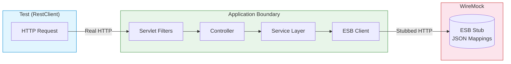
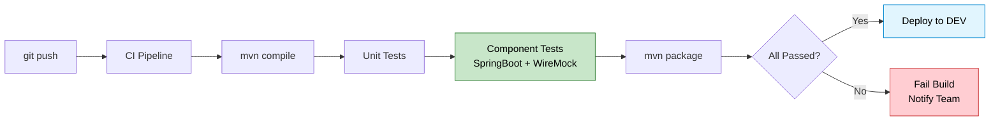
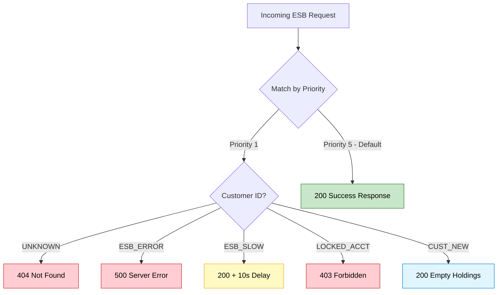
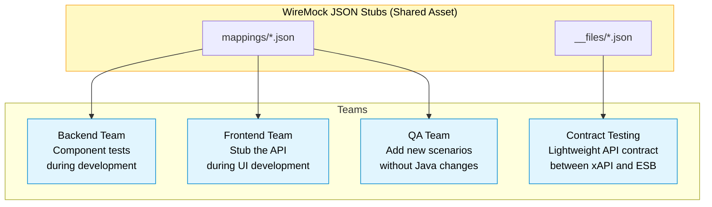

# Mermaid Diagram Fallback

These are Mermaid versions of the component testing diagrams. Use these if your platform supports Mermaid rendering natively (GitHub, GitLab, Azure DevOps).

The primary diagrams are maintained as PlantUML (`.puml`) with exported PNGs for Bitbucket and Confluence compatibility.

## 01 - Request Flow

## 02 - CI/CD Pipeline

## 03 - Stub Routing

## 04 - Test Pyramid

## 05 - Team Sharing

